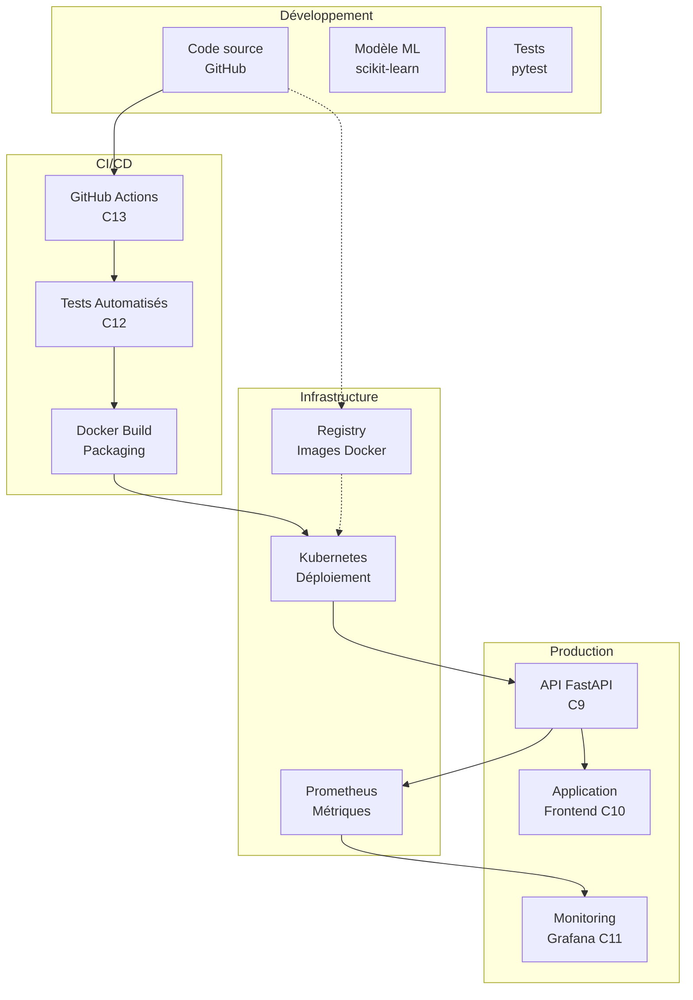

# 🚀 Mise en Service d'un Modèle IA - Compétences C9 à C13

## Table des matières
- [Contexte E3 : Mise en Situation](#contexte-e3--mise-en-situation)
- [Vue d'ensemble des Compétences](#vue-densemble-des-compétences)
- [Architecture Globale MLOps](#architecture-globale-mlops)
- [C9 : API REST pour Modèle IA](#c9--api-rest-pour-modèle-ia)
- [C10 : Intégration dans une Application](#c10--intégration-dans-une-application)
- [C11 : Monitoring du Modèle IA](#c11--monitoring-du-modèle-ia)
- [C12 : Tests Automatisés ML](#c12--tests-automatisés-ml)
- [C13 : Chaîne de Livraison Continue](#c13--chaîne-de-livraison-continue)
- [Checklist de Validation E3](#checklist-de-validation-e3)
- [Rapport Professionnel](#rapport-professionnel)
- [Conclusion](#conclusion)

---

## Contexte E3 : Mise en Situation

### 📋 Scénario projet

**Projet fictif : Observatoire Immobilier Intelligent**

Une agence immobilière souhaite mettre en production un modèle de Machine Learning pour prédire les prix des biens immobiliers. Le modèle a été développé en interne et doit maintenant être :

1. **Mis en service** avec une API REST sécurisée
2. **Intégré** dans l'application web existante
3. **Monitoré** pour garantir sa performance
4. **Testé** automatiquement
5. **Déployé** via une chaîne MLOps

### 🎯 Objectifs métier

- Automatiser les estimations de prix
- Réduire le temps de réponse client
- Garantir la qualité des prédictions
- Maintenir un haut niveau de disponibilité
- Respecter les normes d'accessibilité

### 📊 Livrables attendus

- ✅ **Rapport professionnel individuel** documentant l'ensemble
- ✅ **Soutenance orale** avec démonstration fonctionnelle
- ✅ **Code source versionné** sur dépôt Git distant
- ✅ **Documentation accessible** WCAG 2.1

---

## Vue d'ensemble des Compétences

| Compétence | Titre | Livrable principal |
|------------|-------|-------------------|
| **C9** | API REST Modèle IA | API FastAPI sécurisée |
| **C10** | Intégration Application | Frontend React/Vue.js |
| **C11** | Monitoring Modèle | Dashboard Grafana/Prometheus |
| **C12** | Tests Automatisés ML | Pipeline tests CI/CD |
| **C13** | Chaîne MLOps | GitHub Actions/GitLab CI |

### 🔄 Flux MLOps complet

```
Code Git → CI/CD → Tests → Entraînement → Validation → Packaging → Déploiement → Monitoring
    ↑                                                                              ↓
    ←←←←←←←←←←←←←←←←←←←←←← Amélioration continue ←←←←←←←←←←←←←←←←←←←←←←←←
```

---

## Architecture Globale MLOps

### 🏗️ Vue d'ensemble système



### 🛠️ Stack technique

| Couche | Technologies | Rationnel |
|--------|--------------|-----------|
| **API** | FastAPI, Uvicorn, Pydantic | Performance, documentation auto |
| **ML** | scikit-learn, pandas, numpy | Librairies standards et robustes |
| **Frontend** | React/Vue.js, Axios | Frameworks modernes |
| **Monitoring** | Prometheus, Grafana | Monitoring temps réel |
| **CI/CD** | GitHub Actions, Docker | Intégration continue |
| **Infrastructure** | Kubernetes, Docker | Containerisation et orchestration |

---

## C9 : API REST pour Modèle IA

### 🎯 Objectif

Développer une API REST sécurisée qui expose le modèle de prédiction de prix immobiliers.

### 📋 Critères de validation C9

- [ ] L'API restreint l'accès au modèle avec authentification JWT
- [ ] L'API permet l'accès aux fonctions du modèle selon spécifications
- [ ] Sécurisation OWASP intégrée (validation, rate limiting, HTTPS)
- [ ] Sources versionnées sur dépôt Git distant
- [ ] Tests couvrent tous les endpoints
- [ ] Documentation complète et accessible (OpenAPI)

### 🏗️ Implémentation API

#### Structure du projet

```
src/
├── api/
│   ├── main.py              # Application FastAPI principale
│   ├── endpoints/
│   │   ├── predictions.py   # Endpoint /predict
│   │   ├── auth.py          # Endpoint /auth/token
│   │   └── health.py        # Endpoint /health
│   ├── security.py          # Gestion JWT
│   ├── middleware.py        # Rate limiting OWASP
│   └── dependencies.py      # Injection dépendances
├── ml/
│   ├── predictor.py        # Service prédiction
│   └── model.py            # Modèle scikit-learn
├── schemas/
│   └── prediction.py       # Validation Pydantic
└── tests/
    └── test_api.py          # Tests endpoints
```

#### Code API principale

```python
# src/api/main.py
from fastapi import FastAPI, Depends, HTTPException, status
from fastapi.middleware.cors import CORSMiddleware
from fastapi.middleware.gzip import GZipMiddleware
from fastapi.responses import JSONResponse
import logging

from src.api.endpoints import predictions, auth, health
from src.api.middleware import RateLimitMiddleware
from src.ml.predictor import PricePredictor

# Configuration
app = FastAPI(
    title="🏠 API Prédiction Prix Immobiliers - C9",
    description="API REST sécurisée pour prédiction de prix",
    version="1.0.0",
    docs_url="/docs",
    redoc_url="/redoc"
)

# Middlewares OWASP
app.add_middleware(GZipMiddleware)
app.add_middleware(RateLimitMiddleware, calls=100, period=60)
app.add_middleware(
    CORSMiddleware,
    allow_origins=["https://app-immobilier.com"],
    credentials=True,
    methods=["GET", "POST"],
    headers=["*"]
)

# Routers
app.include_router(auth.router, prefix="/api/v1", tags=["authentification"])
app.include_router(predictions.router, prefix="/api/v1", tags=["predictions"])
app.include_router(health.router, prefix="/api/v1", tags=["system"])

@app.on_event("startup")
async def startup():
    """Charger le modèle ML au démarrage"""
    app.state.predictor = PricePredictor()
    app.state.predictor.load_model("models/price_predictor.joblib")
    logging.info("✅ Modèle ML chargé")

@app.get("/")
async def root():
    return {
        "message": "API Prédiction Prix Immobiliers",
        "version": "1.0.0",
        "docs": "/docs"
    }
```

#### Endpoint de prédiction sécurisé

```python
# src/api/endpoints/predictions.py
from fastapi import APIRouter, Depends, HTTPException, status
from src.api.dependencies import get_current_user
from src.schemas.prediction import PropertyFeatures, PredictionResponse
from src.ml.predictor import PricePredictor
import logging

router = APIRouter()

@router.post("/predict", response_model=PredictionResponse)
async def predict_price(
    property_data: PropertyFeatures,
    current_user: dict = Depends(get_current_user),
    predictor: PricePredictor = Depends(get_predictor)
):
    """
    Prédire le prix d'un bien immobilier

    **Requis**: Token JWT valide
    """
    try:
        # Prédiction avec le modèle
        prediction = predictor.predict(property_data.dict())

        # Journalisation pour monitoring C11
        logging.info(f"Prédiction pour {current_user['username']}: {property_data.code_postal}")

        return prediction

    except Exception as e:
        raise HTTPException(
            status_code=500,
            detail=f"Erreur de prédiction: {str(e)}"
        )
```

#### Sécurité JWT complète

```python
# src/api/security.py
from datetime import datetime, timedelta
from jose import JWTError, jwt
from fastapi import HTTPException, status, Depends
from fastapi.security import HTTPBearer, HTTPAuthorizationCredentials

SECRET_KEY = "votre-cle-secrete-tres-longue-2024"
ALGORITHM = "HS256"
ACCESS_TOKEN_EXPIRE_MINUTES = 30

security = HTTPBearer()

def create_access_token(data: dict):
    """Créer token JWT"""
    to_encode = data.copy()
    expire = datetime.utcnow() + timedelta(minutes=ACCESS_TOKEN_EXPIRE_MINUTES)
    to_encode.update({"exp": expire})
    return jwt.encode(to_encode, SECRET_KEY, algorithm=ALGORITHM)

async def get_current_user(credentials: HTTPAuthorizationCredentials = Depends(security)):
    """Valider token JWT"""
    try:
        payload = jwt.decode(credentials.credentials, SECRET_KEY, algorithms=[ALGORITHM])
        username = payload.get("sub")
        if username is None:
            raise HTTPException(401, "Token invalide")
        return {"username": username}
    except JWTError:
        raise HTTPException(401, "Token invalide")
```

---

## C10 : Intégration dans une Application

### 🎯 Objectif

Intégrer l'API de prédiction dans une application web frontend existante en respectant les spécifications et normes d'accessibilité.

### 📋 Critères de validation C10

- [ ] Application installée et fonctionnelle en dev
- [ ] Communication avec l'API fonctionne
- [ ] Authentification et renouvellement intégrés
- [ ] Tous les endpoints API intégrés
- [ ] Adaptations interfaces accessibles (WCAG 2.1)
- [ ] Tests d'intégration complets
- [ ] Sources versionnées sur Git

### 🌐 Implémentation Frontend (React)

#### Structure application

```
frontend/
├── src/
│   ├── components/
│   │   ├── PredictionForm.js   # Formulaire prédiction
│   │   ├── Auth.js             # Gestion authentification
│   │   └── Results.js          # Affichage résultats
│   ├── services/
│   │   ├── api.js              # Client API
│   │   └── auth.js             # Service auth
│   ├── hooks/
│   │   └── useAuth.js          # Hook authentification
│   └── App.js                  # Application principale
├── public/
│   └── index.html              # Structure accessible
└── tests/
    └── integration/
        └── api.test.js         # Tests intégration
```

#### Client API avec gestion authentification

```javascript
// src/services/api.js
import axios from 'axios';

const API_BASE_URL = process.env.REACT_APP_API_URL || 'https://api.immobilier.com/api/v1';

class APIClient {
  constructor() {
    this.client = axios.create({
      baseURL: API_BASE_URL,
      timeout: 10000,
    });

    // Intercepteur pour ajouter token JWT
    this.client.interceptors.request.use(
      (config) => {
        const token = localStorage.getItem('access_token');
        if (token) {
          config.headers.Authorization = `Bearer ${token}`;
        }
        return config;
      },
      (error) => Promise.reject(error)
    );

    // Intercepteur pour gérer token expiré
    this.client.interceptors.response.use(
      (response) => response,
      async (error) => {
        if (error.response?.status === 401) {
          // Token expiré, tentative de rafraîchissement
          await this.refreshToken();
          // Réessayer la requête
          return this.client.request(error.config);
        }
        return Promise.reject(error);
      }
    );
  }

  async login(username, password) {
    try {
      const response = await this.client.post('/auth/token', {
        username,
        password
      }, {
        headers: { 'Content-Type': 'application/x-www-form-urlencoded' }
      });

      const { access_token, expires_in } = response.data;
      localStorage.setItem('access_token', access_token);

      // Configurer rafraîchissement automatique
      setTimeout(() => this.refreshToken(), expires_in * 1000 - 60000);

      return response.data;
    } catch (error) {
      throw new Error('Échec de l\'authentification');
    }
  }

  async refreshToken() {
    try {
      // Implémenter refresh token ou rediriger vers login
      const response = await this.client.post('/auth/refresh', {
        token: localStorage.getItem('access_token')
      });
      localStorage.setItem('access_token', response.data.access_token);
    } catch (error) {
      this.logout();
    }
  }

  logout() {
    localStorage.removeItem('access_token');
    window.location.href = '/login';
  }

  async predictPrice(propertyData) {
    const response = await this.client.post('/predict', propertyData);
    return response.data;
  }

  async checkHealth() {
    const response = await this.client.get('/health');
    return response.data;
  }
}

export default new APIClient();
```

#### Composant de prédiction accessible

```jsx
// src/components/PredictionForm.js
import React, { useState } from 'react';
import api from '../services/api';
import Results from './Results';

const PredictionForm = () => {
  const [formData, setFormData] = useState({
    surface_m2: '',
    code_postal: '',
    type_bien: '',
    population_quartier: '',
    revenu_moyen_annuel: ''
  });

  const [prediction, setPrediction] = useState(null);
  const [loading, setLoading] = useState(false);
  const [error, setError] = useState(null);

  const typesBien = ['Studio', 'T1', 'T2', 'T3', 'T4', 'T5+', 'Maison'];

  const handleChange = (e) => {
    const { name, value } = e.target;
    setFormData(prev => ({
      ...prev,
      [name]: value
    }));
  };

  const handleSubmit = async (e) => {
    e.preventDefault();
    setLoading(true);
    setError(null);

    try {
      const result = await api.predictPrice(formData);
      setPrediction(result);
    } catch (err) {
      setError(err.message || 'Erreur de prédiction');
    } finally {
      setLoading(false);
    }
  };

  return (
    <main role="main" aria-label="Formulaire de prédiction de prix">
      <h1>Prédiction de Prix Immobilier</h1>

      <form
        onSubmit={handleSubmit}
        aria-labelledby="form-title"
        noValidate
      >
        <h2 id="form-title">Caractéristiques du bien</h2>

        <div className="form-group">
          <label htmlFor="surface">
            Surface (m²) *
            <span className="required" aria-label="obligatoire">*</span>
          </label>
          <input
            type="number"
            id="surface"
            name="surface_m2"
            value={formData.surface_m2}
            onChange={handleChange}
            required
            min="1"
            max="1000"
            aria-describedby="surface-help"
          />
          <small id="surface-help">
            Surface habitable en mètres carrés
          </small>
        </div>

        <div className="form-group">
          <label htmlFor="code-postal">
            Code postal *
            <span className="required" aria-label="obligatoire">*</span>
          </label>
          <input
            type="text"
            id="code-postal"
            name="code_postal"
            value={formData.code_postal}
            onChange={handleChange}
            required
            pattern="[0-9]{5}"
            aria-describedby="cp-help"
          />
          <small id="cp-help">
            Code postal français (5 chiffres)
          </small>
        </div>

        <div className="form-group">
          <label htmlFor="type-bien">
            Type de bien *
            <span className="required" aria-label="obligatoire">*</span>
          </label>
          <select
            id="type-bien"
            name="type_bien"
            value={formData.type_bien}
            onChange={handleChange}
            required
            aria-describedby="type-help"
          >
            <option value="">Sélectionner...</option>
            {typesBien.map(type => (
              <option key={type} value={type}>
                {type}
              </option>
            ))}
          </select>
          <small id="type-help">
            Type de logement
          </small>
        </div>

        {/* Champs optionnels... */}

        <div className="form-actions">
          <button
            type="submit"
            disabled={loading}
            aria-busy={loading}
          >
            {loading ? 'Prédiction en cours...' : 'Prédire le prix'}
          </button>
        </div>

        {error && (
          <div
            className="error-message"
            role="alert"
            aria-live="polite"
          >
            {error}
          </div>
        )}
      </form>

      {prediction && <Results prediction={prediction} />}
    </main>
  );
};

export default PredictionForm;
```

#### Tests d'intégration API

```javascript
// tests/integration/api.test.js
import api from '../../src/services/api';

describe('Tests d\'intégration API', () => {
  beforeAll(async () => {
    // Authentification pour les tests
    await api.login('admin', 'password123');
  });

  test('Communication API fonctionnelle', async () => {
    const health = await api.checkHealth();
    expect(health.status).toBe('healthy');
  });

  test('Prédiction via API', async () => {
    const propertyData = {
      surface_m2: 50,
      code_postal: '75001',
      type_bien: 'T2'
    };

    const prediction = await api.predictPrice(propertyData);

    expect(prediction).toHaveProperty('prix_predit');
    expect(prediction).toHaveProperty('prix_m2_predit');
    expect(prediction.prix_predit).toBeGreaterThan(0);
  });

  test('Gestion erreur API', async () => {
    const invalidData = {
      surface_m2: -10,
      code_postal: 'invalid',
      type_bien: 'Invalid'
    };

    await expect(api.predictPrice(invalidData))
      .rejects.toThrow();
  });

  test('Renouvellement token expiré', async () => {
    // Simuler token expiré
    localStorage.setItem('access_token', 'expired_token');

    // La requête devrait automatiquement rafraîchir le token
    const health = await api.checkHealth();
    expect(health.status).toBe('healthy');
  });
});
```

---

## C11 : Monitoring du Modèle IA

### 🎯 Objectif

Monitorer le modèle de prédiction en temps réel avec métriques pertinentes pour garantir sa performance et permettre l'amélioration itérative.

### 📋 Critères de validation C11

- [ ] Métriques monitoring expliquées et pertinentes
- [ ] Outils adaptés au contexte et contraintes
- [ ] Restitution temps réel (dashboard accessible)
- [ ] Accessibilité prise en compte
- [ ] Chaîne testée en environnement de test
- [ ] Chaîne fonctionnelle avec métriques évaluées
- [ ] Sources versionnées et documentation accessible

### 📊 Métriques de monitoring

#### 1. Métriques de performance modèle

| Métrique | Description | Seuil alerte |
|----------|-------------|--------------|
| **Précision (R²)** | Qualité prédictions sur données réelles | < 0.7 |
| **RMSE** | Erreur quadratique moyenne | > 50000€ |
| **Biais** | Écart moyen prédictions vs réalité | > 10% |
| **Drift données** | Distribution features vs entraînement | > 0.3 KL |

#### 2. Métriques opérationnelles

| Métrique | Description | Seuil alerte |
|----------|-------------|--------------|
| **Latence API** | Temps réponse prédiction | > 500ms |
| **Taux erreur** | Requêtes échouées / total | > 5% |
| **Throughput** | Prédictions par seconde | < 100/s |
| **Disponibilité** | % temps API fonctionnelle | < 99.9% |

#### 3. Métriques business

| Métrique | Description | Utilité |
|----------|-------------|---------|
| **Prédictions/jour** | Volume d'utilisation | Adoption |
| **Satisfaction** | Feedback utilisateurs | Qualité perçue |
| **Conversion** | Estimations → Visites | Impact business |

### 🛠️ Implémentation monitoring

#### Endpoint métriques dans l'API

```python
# src/api/endpoints/monitoring.py
from fastapi import APIRouter, Depends
from prometheus_client import Counter, Histogram, Gauge, generate_latest
from src.api.dependencies import get_current_user
import time
import psutil
from src.ml.predictor import PricePredictor

router = APIRouter()

# Compteurs Prometheus
PREDICTIONS_TOTAL = Counter('predictions_total', 'Total prédictions', ['status'])
PREDICTION_LATENCY = Histogram('prediction_latency_seconds', 'Latence prédictions')
MODEL_ACCURACY = Gauge('model_accuracy', 'Précision modèle (R²)')
API_MEMORY_USAGE = Gauge('api_memory_usage_bytes', 'Mémoire utilisée par API')

@router.get("/metrics")
async def get_metrics():
    """Exporter métriques Prometheus"""
    # Métriques système
    API_MEMORY_USAGE.set(psutil.Process().memory_info().rss)

    return Response(generate_latest(), media_type="text/plain")

@router.post("/feedback")
async def prediction_feedback(
    feedback_data: FeedbackSchema,
    current_user: dict = Depends(get_current_user)
):
    """Collecter feedback utilisateurs pour monitoring C11"""
    # Enregistrer feedback pour analyse biais modèle
    record_feedback(feedback_data)
    PREDICTIONS_TOTAL.labels(status='feedback').inc()

    return {"status": "recorded"}
```

#### Service de monitoring Python

```python
# src/monitoring/model_monitor.py
import numpy as np
import pandas as pd
from scipy import stats
import logging
from datetime import datetime, timedelta

class ModelMonitor:
    """Monitoring du modèle ML en production"""

    def __init__(self, predictor: PricePredictor):
        self.predictor = predictor
        self.reference_stats = None
        self.load_reference_stats()

    def check_data_drift(self, current_data: pd.DataFrame) -> dict:
        """
        Détecter drift dans les données d'entrée

        Returns:
            dict: Métriques drift et alertes
        """
        drift_scores = {}

        for feature in current_data.columns:
            if feature in self.reference_stats:
                # Test Kolmogorov-Smirnov pour détecter drift
                ref_dist = self.reference_stats[feature]['distribution']
                curr_dist = current_data[feature].values

                ks_stat, p_value = stats.ks_2samp(ref_dist, curr_dist)

                drift_scores[feature] = {
                    'ks_statistic': ks_stat,
                    'p_value': p_value,
                    'drift_detected': ks_stat > 0.3,  # Seuil drift
                    'alert': ks_stat > 0.5  # Seuil alerte forte
                }

        # Journalisation drift pour dashboard
        self.log_drift_metrics(drift_scores)

        return drift_scores

    def calculate_model_performance(
        self,
        predictions: np.ndarray,
        actuals: np.ndarray
    ) -> dict:
        """
        Calculer métriques performance modèle en production
        """
        from sklearn.metrics import r2_score, mean_squared_error

        r2 = r2_score(actuals, predictions)
        rmse = np.sqrt(mean_squared_error(actuals, predictions))
        bias = np.mean(predictions - actuals)

        metrics = {
            'r2_score': r2,
            'rmse': rmse,
            'bias': bias,
            'accuracy_degraded': r2 < 0.7,
            'high_error': rmse > 50000,
            'biased': abs(bias) > 0.1
        }

        # Exporter vers Prometheus
        MODEL_ACCURACY.set(r2)

        # Alertes si dégradation
        if r2 < 0.7:
            self.send_alert(f"Précision modèle dégradée: {r2:.2f}")

        return metrics

    def check_prediction_quality(self, prediction: dict) -> dict:
        """
        Valider qualité d'une prédiction individuelle
        """
        quality_checks = {
            'price_reasonable': 1000 < prediction['prix_predit'] < 10000000,
            'confidence_acceptable': prediction['confiance'] > 0.8,
            'interval_width_reasonable': (
                prediction['intervalle_confiance']['max'] -
                prediction['intervalle_confiance']['min']
            ) < prediction['prix_predit'] * 0.5
        }

        return quality_checks
```

#### Dashboard Grafana accessible

```json
{
  "dashboard": {
    "id": null,
    "title": "🏠 Monitoring Modèle Prédiction Immobilière",
    "tags": ["ml", "monitoring", "c11"],
    "timezone": "Europe/Paris",
    "panels": [
      {
        "title": "Prédictions par minute",
        "type": "stat",
        "targets": [
          {
            "expr": "rate(predictions_total[1m])",
            "legendFormat": "Prédictions/min"
          }
        ],
        "fieldConfig": {
          "defaults": {
            "color": {
              "mode": "palette-classic"
            },
            "unit": "reqps"
          }
        }
      },
      {
        "title": "Latence moyenne prédiction",
        "type": "timeseries",
        "targets": [
          {
            "expr": "histogram_quantile(0.95, rate(prediction_latency_seconds_bucket[5m]))",
            "legendFormat": "P95"
          },
          {
            "expr": "histogram_quantile(0.50, rate(prediction_latency_seconds_bucket[5m]))",
            "legendFormat": "P50"
          }
        ],
        "fieldConfig": {
          "defaults": {
            "unit": "s",
            "thresholds": {
              "steps": [
                {"color": "green", "value": null},
                {"color": "yellow", "value": 0.5},
                {"color": "red", "value": 1}
              ]
            }
          }
        }
      },
      {
        "title": "Précision modèle (R²)",
        "type": "stat",
        "targets": [
          {
            "expr": "model_accuracy",
            "legendFormat": "R²"
          }
        ],
        "fieldConfig": {
          "defaults": {
            "unit": "percentunit",
            "thresholds": {
              "steps": [
                {"color": "red", "value": null},
                {"color": "yellow", "value": 0.7},
                {"color": "green", "value": 0.8}
              ]
            }
          }
        }
      },
      {
        "title": "Distribution erreurs de prédiction",
        "type": "heatmap",
        "targets": [
          {
            "expr": "rate(prediction_errors_bucket[1h])",
            "legendFormat": "{{le}}"
          }
        ]
      }
    ],
    "time": {
      "from": "now-1h",
      "to": "now"
    },
    "refresh": "30s"
  }
}
```

### ♿ Accessibilité du monitoring

- **Contraste élevé** sur dashboard Grafana
- **Lecture écran** compatible avec tableaux HTML
- **Navigation clavier** sur tous les panneaux
- **Textes alternatifs** pour graphiques
- **Export PDF accessible** pour rapports

---

## C12 : Tests Automatisés ML

### 🎯 Objectif

Programmer une suite complète de tests automatisés pour valider le modèle ML, les données et le pipeline MLOps.

### 📋 Critères de validation C12

- [ ] Cas de test listés et définis (modèle, données, préparation, entraînement, évaluation)
- [ ] Outils tests cohérents avec environnement
- [ ] Tests intégrés avec couverture souhaitée (>80%)
- [ ] Tests exécutables sans problème en environnement test
- [ ] Sources versionnées (Git/DVC)
- [ ] Documentation accessible procédures tests

### 🧪 Architecture de tests

```
tests/
├── unit/
│   ├── test_model.py          # Tests unitaires modèle
│   ├── test_preprocessing.py  # Tests préparation données
│   └── test_api.py            # Tests unitaires API
├── integration/
│   ├── test_pipeline.py       # Tests pipeline complet
│   └── test_monitoring.py     # Tests monitoring
├── ml/
│   ├── test_data_validation.py# Tests validation données
│   ├── test_training.py       # Tests entraînement modèle
│   └── test_model_performance.py # Tests performance modèle
├── e2e/
│   └── test_full_pipeline.py  # Tests end-to-end
├── fixtures/
│   ├── sample_data.csv        # Données test
│   └── test_model.joblib      # Modèle test
└── conftest.py                # Configuration pytest
```

### 📝 Tests complets du pipeline ML

#### Configuration pytest

```python
# conftest.py
import pytest
import pandas as pd
import numpy as np
import tempfile
from pathlib import Path

@pytest.fixture(scope="session")
def sample_data():
    """Générer données de test réalistes"""
    np.random.seed(42)

    data = {
        'surface_m2': np.random.randint(20, 200, 1000),
        'code_postal': np.random.choice(['75001', '69001', '13001', '33000', '31000'], 1000),
        'type_bien': np.random.choice(['Studio', 'T1', 'T2', 'T3', 'T4'], 1000),
        'prix_euros': np.random.randint(100000, 1000000, 1000)
    }

    return pd.DataFrame(data)

@pytest.fixture
def temp_model_path():
    """Chemin temporaire pour modèle test"""
    with tempfile.NamedTemporaryFile(suffix='.joblib', delete=False) as f:
        yield f.name
    Path(f.name).unlink()

@pytest.fixture
def ml_pipeline(sample_data, temp_model_path):
    """Pipeline ML complet pour tests"""
    from sklearn.preprocessing import StandardScaler, LabelEncoder
    from sklearn.ensemble import RandomForestRegressor
    from sklearn.pipeline import Pipeline
    import joblib

    # Préparation données
    X = sample_data[['surface_m2', 'code_postal', 'type_bien']]
    y = sample_data['prix_euros']

    # Encodage variables catégorielles
    X_encoded = X.copy()
    le_cp = LabelEncoder()
    X_encoded['code_postal'] = le_cp.fit_transform(X['code_postal'])

    le_type = LabelEncoder()
    X_encoded['type_bien'] = le_type.fit_transform(X['type_bien'])

    # Pipeline ML
    pipeline = Pipeline([
        ('scaler', StandardScaler()),
        ('model', RandomForestRegressor(n_estimators=10, random_state=42))
    ])

    # Entraînement
    pipeline.fit(X_encoded, y)

    # Sauvegarde avec encodeurs
    model_data = {
        'pipeline': pipeline,
        'encoders': {
            'code_postal': le_cp,
            'type_bien': le_type
        }
    }

    joblib.dump(model_data, temp_model_path)

    return {
        'model_path': temp_model_path,
        'encoders': model_data['encoders'],
        'feature_columns': ['surface_m2', 'code_postal', 'type_bien']
    }
```

#### Tests validation des données

```python
# tests/ml/test_data_validation.py
import pytest
import pandas as pd
import numpy as np
from src.ml.data_validator import DataValidator

class TestDataValidation:
    """Tests validation des jeux de données"""

    def test_schema_validation_valid_data(self, sample_data):
        """Test validation schéma avec données valides"""
        validator = DataValidator()

        # Données valides
        valid_data = sample_data.head(100)

        result = validator.validate_schema(valid_data)

        assert result['valid'] is True
        assert len(result['errors']) == 0

    def test_schema_validation_invalid_data(self):
        """Test validation schéma avec données invalides"""
        validator = DataValidator()

        # Données invalides
        invalid_data = pd.DataFrame({
            'surface_m2': [-10, 0, 2000],  # Surface invalide
            'code_postal': ['123', 'abc', '123456'],  # CP invalide
            'type_bien': ['InvalidType', None, ''],
            'prix_euros': [0, -1000, None]  # Prix invalide
        })

        result = validator.validate_schema(invalid_data)

        assert result['valid'] is False
        assert len(result['errors']) > 0

        # Vérifier erreurs spécifiques
        error_messages = [e['message'] for e in result['errors']]
        assert any('surface' in msg.lower() for msg in error_messages)
        assert any('code postal' in msg.lower() for msg in error_messages)

    def test_data_quality_checks(self, sample_data):
        """Test contrôles qualité des données"""
        validator = DataValidator()

        # Ajouter données de mauvaise qualité
        poor_data = sample_data.copy()
        poor_data.loc[0:10, 'surface_m2'] = np.nan  # Valeurs manquantes
        poor_data.loc[20:30, 'prix_euros'] = 0  # Prix nuls

        quality_report = validator.check_data_quality(poor_data)

        assert quality_report['missing_values'] > 0
        assert quality_report['zero_values'] > 0
        assert quality_report['duplicate_rows'] >= 0

        # Métriques qualité
        assert 'completeness' in quality_report
        assert quality_report['completeness'] < 1.0

    def test_data_drift_detection(self, sample_data):
        """Test détection drift données"""
        validator = DataValidator()

        # Référence : données normales
        reference_data = sample_data.sample(500)

        # Données avec drift : prix augmentés de 50%
        drifted_data = sample_data.sample(500).copy()
        drifted_data['prix_euros'] *= 1.5

        drift_report = validator.detect_drift(reference_data, drifted_data)

        assert 'drift_detected' in drift_report
        assert 'drift_score' in drift_report
        assert 'features_drift' in drift_report

        # Devrait détecter drift sur prix
        assert drift_report['drift_detected'] is True
        assert 'prix_euros' in drift_report['features_drift']
```

#### Tests entraînement modèle

```python
# tests/ml/test_training.py
import pytest
import numpy as np
from sklearn.metrics import r2_score, mean_squared_error
from src.ml.trainer import ModelTrainer
from src.ml.model_utils import load_model, save_model

class TestModelTraining:
    """Tests processus d'entraînement modèle"""

    def test_training_pipeline_complete(self, sample_data, tmp_path):
        """Test pipeline entraînement complet"""
        trainer = ModelTrainer()

        # Configuration entraînement
        config = {
            'target_column': 'prix_euros',
            'test_size': 0.2,
            'random_state': 42,
            'model_params': {
                'n_estimators': 50,
                'max_depth': 10,
                'random_state': 42
            }
        }

        # Entraînement
        model_path = tmp_path / "test_model.joblib"
        training_result = trainer.train(sample_data, config, str(model_path))

        # Vérifications
        assert training_result['success'] is True
        assert 'model_metrics' in training_result
        assert model_path.exists()

        # Métriques entraînement
        metrics = training_result['model_metrics']
        assert 'train_r2' in metrics
        assert 'test_r2' in metrics
        assert 'train_rmse' in metrics
        assert 'test_rmse' in metrics

        # Qualité modèle
        assert metrics['test_r2'] > 0.5  # Performance minimale
        assert metrics['test_r2'] < 1.0   # Pas d'overfitting parfait

    def test_feature_engineering(self, sample_data):
        """Test engineering des features"""
        trainer = ModelTrainer()

        # Application feature engineering
        processed_data = trainer.engineer_features(sample_data)

        # Vérifications
        assert 'prix_m2' in processed_data.columns  # Feature calculée
        assert 'surface_category' in processed_data.columns  # Feature catégorielle
        assert processed_data['prix_m2'].notna().all()  # Pas de valeurs manquantes

        # Valeurs cohérentes
        assert (processed_data['prix_m2'] > 0).all()
        assert set(processed_data['surface_category'].unique()).issubset({
            'petit', 'moyen', 'grand', 'tres_grand'
        })

    def test_cross_validation(self, sample_data):
        """Test validation croisée"""
        trainer = ModelTrainer()

        cv_results = trainer.cross_validate(
            sample_data,
            cv_folds=5,
            target_column='prix_euros'
        )

        # Vérifications
        assert 'cv_scores' in cv_results
        assert 'mean_score' in cv_results
        assert 'std_score' in cv_results

        # Scores cohérents
        scores = cv_results['cv_scores']
        assert len(scores) == 5
        assert all(0 <= score <= 1 for score in scores)  # R² scores
        assert cv_results['std_score'] > 0  # Variabilité entre folds

    def test_hyperparameter_tuning(self, sample_data, tmp_path):
        """Test optimisation hyperparamètres"""
        trainer = ModelTrainer()

        # Grille d'hyperparamètres
        param_grid = {
            'n_estimators': [10, 50],
            'max_depth': [5, 10],
            'min_samples_split': [2, 5]
        }

        best_params = trainer.optimize_hyperparameters(
            sample_data,
            param_grid,
            target_column='prix_euros',
            cv_folds=3
        )

        # Vérifications
        assert 'best_params' in best_params
        assert 'best_score' in best_params
        assert 'cv_results' in best_params

        # Paramètres dans grille
        assert best_params['best_params']['n_estimators'] in [10, 50]
        assert best_params['best_params']['max_depth'] in [5, 10]
```

#### Tests performance modèle

```python
# tests/ml/test_model_performance.py
import pytest
import numpy as np
from src.ml.evaluator import ModelEvaluator
from src.ml.predictor import PricePredictor

class TestModelPerformance:
    """Tests performance modèle en conditions réelles"""

    def test_prediction_accuracy(self, ml_pipeline, sample_data):
        """Test précision prédictions sur données test"""
        evaluator = ModelEvaluator()
        predictor = PricePredictor()
        predictor.load_model(ml_pipeline['model_path'])

        # Données test (non utilisées pour entraînement)
        test_data = sample_data.sample(100, random_state=42)

        # Prédictions
        predictions = []
        actuals = []

        for _, row in test_data.iterrows():
            pred_data = {
                'surface_m2': row['surface_m2'],
                'code_postal': row['code_postal'],
                'type_bien': row['type_bien']
            }

            prediction = predictor.predict(pred_data)
            predictions.append(prediction['prix_predit'])
            actuals.append(row['prix_euros'])

        # Évaluation performance
        performance = evaluator.evaluate_predictions(predictions, actuals)

        # Critères performance
        assert performance['r2_score'] > 0.6  # Précision minimale
        assert performance['rmse'] < 100000   # Erreur maximale acceptable
        assert performance['mae'] < 50000     # Erreur moyenne acceptable

        # Pas de biais systématique
        assert abs(performance['bias']) < 0.1  # Biais < 10%

    def test_prediction_consistency(self, ml_pipeline):
        """Test cohérence prédictions multiples"""
        predictor = PricePredictor()
        predictor.load_model(ml_pipeline['model_path'])

        test_input = {
            'surface_m2': 50,
            'code_postal': '75001',
            'type_bien': 'T2'
        }

        # Prédictions multiples même entrée
        predictions = []
        for _ in range(10):
            pred = predictor.predict(test_input)
            predictions.append(pred['prix_predit'])

        # Variance faible (déterministe)
        variance = np.var(predictions)
        assert variance < 1e-10  # Presque zéro pour modèle déterministe

        # Même intervalle confiance
        first_pred = predictor.predict(test_input)
        second_pred = predictor.predict(test_input)

        assert first_pred['intervalle_confiance'] == second_pred['intervalle_confiance']

    def test_edge_cases(self, ml_pipeline):
        """Test cas limites et valeurs extrêmes"""
        predictor = PricePredictor()
        predictor.load_model(ml_pipeline['model_path'])

        # Cas limites
        edge_cases = [
            {'surface_m2': 15, 'code_postal': '75001', 'type_bien': 'Studio'},     # Min
            {'surface_m2': 300, 'code_postal': '75001', 'type_bien': 'Maison'},      # Max
            {'surface_m2': 100, 'code_postal': '20000', 'type_bien': 'T3'},          # CP inconnu
        ]

        for case in edge_cases:
            try:
                prediction = predictor.predict(case)

                # Vérifications résultat
                assert prediction['prix_predit'] > 0
                assert prediction['prix_m2_predit'] > 0
                assert prediction['confiance'] > 0

            except Exception as e:
                # Si erreur, doit être gérée proprement
                assert 'valeur' in str(e).lower() or 'invalide' in str(e).lower()

    def test_feature_importance(self, ml_pipeline):
        """Test importance features cohérente"""
        predictor = PricePredictor()
        predictor.load_model(ml_pipeline['model_path'])

        importance = predictor.get_feature_importance()

        # Vérifications
        assert isinstance(importance, dict)
        assert len(importance) > 0

        # Features principales attendues
        expected_features = ['surface_m2', 'code_postal', 'type_bien_encoded']
        for feature in expected_features:
            assert feature in importance

        # Valeurs entre 0 et 1
        for feature, score in importance.items():
            assert 0 <= score <= 1

        # Surface devrait être importante
        assert importance.get('surface_m2', 0) > 0.1
```

#### Tests end-to-end pipeline

```python
# tests/e2e/test_full_pipeline.py
import pytest
import requests
import pandas as pd
from pathlib import Path

class TestFullPipeline:
    """Tests end-to-end pipeline ML complet"""

    @pytest.fixture(scope="class")
    def api_client(self):
        """Client pour tests API"""
        base_url = "http://localhost:8000/api/v1"

        # Authentification
        auth_response = requests.post(
            f"{base_url}/auth/token",
            data={"username": "test_user", "password": "test_password"}
        )
        token = auth_response.json()["access_token"]

        headers = {"Authorization": f"Bearer {token}"}

        return {"base_url": base_url, "headers": headers}

    def test_complete_prediction_flow(self, api_client):
        """Test flux complet de prédiction"""
        # Données test
        property_data = {
            "surface_m2": 75,
            "code_postal": "75001",
            "type_bien": "T3",
            "population_quartier": 30000,
            "revenu_moyen_annuel": 35000
        }

        # Appel API prédiction
        response = requests.post(
            f"{api_client['base_url']}/predict",
            json=property_data,
            headers=api_client['headers']
        )

        # Vérifications
        assert response.status_code == 200

        prediction = response.json()
        assert "prix_predit" in prediction
        assert "prix_m2_predit" in prediction
        assert "intervalle_confiance" in prediction

        # Logique métier
        assert prediction["prix_predit"] > 0
        assert prediction["prix_m2_predit"] > 0
        assert prediction["intervalle_confiance"]["max"] > prediction["intervalle_confiance"]["min"]

    def test_batch_predictions(self, api_client):
        """Test prédictions par lot"""
        # Données batch
        batch_data = [
            {"surface_m2": 50, "code_postal": "75001", "type_bien": "T2"},
            {"surface_m2": 100, "code_postal": "69001", "type_bien": "T3"},
            {"surface_m2": 30, "code_postal": "13001", "type_bien": "Studio"}
        ]

        predictions = []

        for data in batch_data:
            response = requests.post(
                f"{api_client['base_url']}/predict",
                json=data,
                headers=api_client['headers']
            )
            assert response.status_code == 200
            predictions.append(response.json())

        # Cohérence batch
        assert len(predictions) == 3
        for pred in predictions:
            assert pred["prix_predit"] > 0

    def test_monitoring_integration(self, api_client):
        """Test intégration monitoring"""
        # Vérifier endpoint monitoring
        response = requests.get(f"{api_client['base_url']}/monitoring/health")
        assert response.status_code == 200

        health_data = response.json()
        assert "model_status" in health_data
        assert "predictions_count" in health_data

    def test_error_handling(self, api_client):
        """Test gestion erreurs"""
        # Données invalides
        invalid_data = {
            "surface_m2": -10,
            "code_postal": "invalid",
            "type_bien": "InvalidType"
        }

        response = requests.post(
            f"{api_client['base_url']}/predict",
            json=invalid_data,
            headers=api_client['headers']
        )

        assert response.status_code == 422  # Validation error

        error_data = response.json()
        assert "detail" in error_data
```

### 📊 Rapport de couverture

```python
# scripts/generate_coverage_report.py
import pytest
import subprocess
import json
from pathlib import Path

def generate_coverage_report():
    """Générer rapport couverture tests"""

    # Exécution tests avec couverture
    result = subprocess.run([
        "pytest",
        "--cov=src",
        "--cov-report=json",
        "--cov-report=html",
        "--cov-report=term",
        "tests/"
    ], capture_output=True, text=True)

    if result.returncode != 0:
        print(f"Erreur exécution tests: {result.stderr}")
        return

    # Lecture rapport JSON
    coverage_file = Path("coverage.json")
    if coverage_file.exists():
        with open(coverage_file) as f:
            coverage_data = json.load(f)

        # Générer rapport accessible
        generate_accessible_report(coverage_data)

def generate_accessible_report(coverage_data):
    """Générer rapport HTML accessible"""

    html_template = """
    <!DOCTYPE html>
    <html lang="fr">
    <head>
        <meta charset="UTF-8">
        <meta name="viewport" content="width=device-width, initial-scale=1.0">
        <title>Rapport Couverture Tests - C12</title>
        <style>
            body { font-family: Arial; line-height: 1.6; }
            table { width: 100%; border-collapse: collapse; }
            th, td { padding: 8px; text-align: left; border: 1px solid #ddd; }
            .high { background-color: #d4edda; }
            .medium { background-color: #fff3cd; }
            .low { background-color: #f8d7da; }
            .sr-only { position: absolute; width: 1px; height: 1px; }
        </style>
    </head>
    <body>
        <h1>Rapport Couverture Tests - Compétence C12</h1>

        <h2>Couverture globale</h2>
        <p>Couverture totale: {total_coverage}%</p>

        <h2>Détail par module</h2>
        <table>
            <thead>
                <tr>
                    <th>Module</th>
                    <th>Couverture</th>
                    <th>Status</th>
                </tr>
            </thead>
            <tbody>
                {table_rows}
            </tbody>
        </table>
    </body>
    </html>
    """

    total_coverage = coverage_data['totals']['percent_covered']

    # Générer lignes tableau
    table_rows = []
    for file_name, file_data in coverage_data['files'].items():
        coverage = file_data['summary']['percent_covered']
        status = "high" if coverage >= 80 else "medium" if coverage >= 60 else "low"

        table_rows.append(f"""
            <tr class="{status}">
                <td>{file_name}</td>
                <td>{coverage:.1f}%</td>
                <td>
                    <span aria-label="Couverture {status}">
                        {"✅" if status == "high" else "⚠️" if status == "medium" else "❌"}
                    </span>
                </td>
            </tr>
        """)

    html_content = html_template.format(
        total_coverage=total_coverage,
        table_rows="".join(table_rows)
    )

    with open("reports/coverage_report_accessible.html", "w") as f:
        f.write(html_content)

if __name__ == "__main__":
    generate_coverage_report()
```

---

## C13 : Chaîne de Livraison Continue

### 🎯 Objectif

Créer une chaîne CI/CD complète pour automatiser la livraison du modèle ML avec tests, validation, packaging et déploiement.

### 📋 Critères de validation C13

- [ ] Documentation complète étapes, tâches, déclencheurs
- [ ] Déclencheurs intégrés comme défini
- [ ] Fichiers configuration reconnus et exécutés
- [ ] Tests données intégrés sans erreur
- [ ] Tests entraînement/validation exécutés sans erreur
- [ ] Sources chaîne versionnées sur Git
- [ ] Documentation accessible installation/configuration

### 🔄 Implémentation GitHub Actions

#### Workflow principal CI/CD

```yaml
# .github/workflows/ml-pipeline.yml
name: 🚀 ML Pipeline CI/CD - C13

on:
  push:
    branches: [main, develop]
  pull_request:
    branches: [main]
  schedule:
    # Ré-entraînement quotidien à 2h du matin
    - cron: '0 2 * * *'
  workflow_dispatch:
    inputs:
      retrain_model:
        description: 'Forcer ré-entraînement modèle'
        required: false
        default: 'false'

env:
  PYTHON_VERSION: '3.9'
  REGISTRY: ghcr.io
  IMAGE_NAME: ${{ github.repository }}

jobs:
  # --- Phase 1: Tests et Validation ---
  test:
    runs-on: ubuntu-latest
    name: 🧪 Tests et Validation

    steps:
      - name: 📥 Checkout code
        uses: actions/checkout@v4
        with:
          fetch-depth: 0  # Pour Git history

      - name: 🐍 Setup Python
        uses: actions/setup-python@v4
        with:
          python-version: ${{ env.PYTHON_VERSION }}

      - name: 📦 Cache dependencies
        uses: actions/cache@v3
        with:
          path: ~/.cache/pip
          key: ${{ runner.os }}-pip-${{ hashFiles('**/requirements.txt') }}

      - name: 🔧 Install dependencies
        run: |
          python -m pip install --upgrade pip
          pip install -r requirements.txt
          pip install -r requirements-dev.txt

      - name: 🔍 Lint code quality
        run: |
          flake8 src tests --max-line-length=100
          black --check src tests
          isort --check-only src tests

      - name: 🧪 Run unit tests
        run: |
          pytest tests/unit/ -v --cov=src --cov-report=xml

      - name: 📊 Upload coverage to Codecov
        uses: codecov/codecov-action@v3
        with:
          file: ./coverage.xml
          flags: unittests
          name: codecov-umbrella

      - name: 🧪 Run integration tests
        run: |
          pytest tests/integration/ -v

      - name: 🔬 Run ML tests (C12)
        run: |
          pytest tests/ml/ -v --cov=src/ml

      - name: 📋 Generate test report
        uses: dorny/test-reporter@v1
        if: success() || failure()
        with:
          name: Tests Results
          path: reports/test-report.xml
          reporter: java-junit

  # --- Phase 2: Tests Données ---
  test-data:
    runs-on: ubuntu-latest
    name: 📊 Tests Validation Données
    needs: test

    steps:
      - name: 📥 Checkout code
        uses: actions/checkout@v4

      - name: 🐍 Setup Python
        uses: actions/setup-python@v4
        with:
          python-version: ${{ env.PYTHON_VERSION }}

      - name: 🔧 Install dependencies
        run: |
          pip install -r requirements.txt

      - name: 📥 Download test data
        run: |
          python scripts/download_test_data.py

      - name: ✅ Validate data schema
        run: |
          python scripts/validate_data.py --data-path=data/test/

      - name: 🔍 Check data quality
        run: |
          python scripts/check_data_quality.py --data-path=data/test/

      - name: 📊 Generate data report
        run: |
          python scripts/generate_data_report.py --output reports/data-quality.html

  # --- Phase 3: Entraînement Modèle ---
  train-model:
    runs-on: ubuntu-latest
    name: 🤖 Entraînement Modèle
    needs: [test, test-data]
    if: github.event_name == 'schedule' || github.event.inputs.retrain_model == 'true'

    steps:
      - name: 📥 Checkout code
        uses: actions/checkout@v4

      - name: 🐍 Setup Python
        uses: actions/setup-python@v4
        with:
          python-version: ${{ env.PYTHON_VERSION }}

      - name: 🔧 Install dependencies
        run: |
          pip install -r requirements.txt
          pip install dvc[s3]  # Pour versioning données

      - name: 📥 Pull latest data
        run: |
          dvc pull data/raw/

      - name: 🔄 Preprocess data
        run: |
          python scripts/preprocess_data.py

      - name: 🤖 Train model
        run: |
          python scripts/train_model.py \
            --data-path data/processed/ \
            --output-path models/ \
            --config config/model_config.yaml

      - name: 📊 Evaluate model
        run: |
          python scripts/evaluate_model.py \
            --model-path models/latest/ \
            --test-data data/test/ \
            --output reports/model_evaluation.json

      - name: 💾 Upload model artifact
        uses: actions/upload-artifact@v3
        with:
          name: trained-model
          path: models/latest/

      - name: 📝 Model metrics
        run: |
          echo "## 📊 Modèle Metrics" >> $GITHUB_STEP_SUMMARY
          python -c "import json; print(json.dumps(json.load(open('reports/model_evaluation.json')), indent=2))" >> $GITHUB_STEP_SUMMARY

  # --- Phase 4: Build Docker Image ---
  build:
    runs-on: ubuntu-latest
    name: 🐳 Build Image Docker
    needs: [test, test-data]
    if: github.ref == 'refs/heads/main'

    outputs:
      image-digest: ${{ steps.build.outputs.digest }}
      image-tag: ${{ steps.meta.outputs.tags }}

    steps:
      - name: 📥 Checkout code
        uses: actions/checkout@v4

      - name: 🔐 Set up Docker Buildx
        uses: docker/setup-buildx-action@v3

      - name: 🔑 Log in to Container Registry
        uses: docker/login-action@v3
        with:
          registry: ${{ env.REGISTRY }}
          username: ${{ github.actor }}
          password: ${{ secrets.GITHUB_TOKEN }}

      - name: 📋 Extract metadata
        id: meta
        uses: docker/metadata-action@v5
        with:
          images: ${{ env.REGISTRY }}/${{ env.IMAGE_NAME }}
          tags: |
            type=ref,event=branch
            type=ref,event=pr
            type=sha,prefix={{branch}}-
            type=raw,value=latest,enable={{is_default_branch}}

      - name: 🐳 Build and push Docker image
        id: build
        uses: docker/build-push-action@v5
        with:
          context: .
          platforms: linux/amd64,linux/arm64
          push: true
          tags: ${{ steps.meta.outputs.tags }}
          labels: ${{ steps.meta.outputs.labels }}
          cache-from: type=gha
          cache-to: type=gha,mode=max

      - name: 🔍 Generate SBOM
        run: |
          docker run --rm -v $(pwd):/app syft dir:/app -o cyclonedx-json > sbom.json

      - name: 📤 Upload SBOM
        uses: actions/upload-artifact@v3
        with:
          name: sbom
          path: sbom.json

  # --- Phase 5: Security Scan ---
  security:
    runs-on: ubuntu-latest
    name: 🔒 Sécurité
    needs: build

    steps:
      - name: 📥 Checkout code
        uses: actions/checkout@v4

      - name: 🔍 Run Trivy vulnerability scanner
        uses: aquasecurity/trivy-action@master
        with:
          image-ref: ${{ needs.build.outputs.image-tag }}
          format: 'sarif'
          output: 'trivy-results.sarif'

      - name: 📤 Upload Trivy scan results to GitHub Security tab
        uses: github/codeql-action/upload-sarif@v2
        with:
          sarif_file: 'trivy-results.sarif'

  # --- Phase 6: Déploiement Staging ---
  deploy-staging:
    runs-on: ubuntu-latest
    name: 🚀 Déploiement Staging
    needs: [build, security]
    if: github.ref == 'refs/heads/main'
    environment: staging

    steps:
      - name: 📥 Checkout code
        uses: actions/checkout@v4

      - name: 🔧 Setup kubectl
        uses: azure/setup-kubectl@v3
        with:
          version: 'v1.28.0'

      - name: 🔑 Configure kubectl
        run: |
          echo "${{ secrets.KUBE_CONFIG }}" | base64 -d > kubeconfig
          export KUBECONFIG=kubeconfig

      - name: 🚀 Deploy to staging
        run: |
          export KUBECONFIG=kubeconfig

          # Mise à jour déploiement avec nouvelle image
          kubectl set image deployment/ml-api-staging \
            api=${{ needs.build.outputs.image-tag }} \
            -n staging

          # Attendre déploiement
          kubectl rollout status deployment/ml-api-staging \
            -n staging --timeout=300s

      - name: 🧪 Run smoke tests
        run: |
          # Tests sur environnement staging
          python scripts/smoke_tests.py \
            --endpoint https://staging-api.immobilier.com

      - name: 📊 Upload deployment report
        uses: actions/upload-artifact@v3
        with:
          name: staging-deployment-report
          path: reports/staging-deployment.html

  # --- Phase 7: Déploiement Production ---
  deploy-production:
    runs-on: ubuntu-latest
    name: 🎯 Déploiement Production
    needs: [build, security, deploy-staging]
    if: github.ref == 'refs/heads/main'
    environment: production

    steps:
      - name: 📥 Checkout code
        uses: actions/checkout@v4

      - name: 👮 Manual approval
        uses: trstringer/manual-approval@v1
        with:
          secret: ${{ github.TOKEN }}
          approvers: team-leads
          minimum-approvals: 2

      - name: 🔧 Setup kubectl
        uses: azure/setup-kubectl@v3
        with:
          version: 'v1.28.0'

      - name: 🚀 Deploy to production
        run: |
          # Configuration production
          echo "${{ secrets.KUBE_PROD_CONFIG }}" | base64 -d > kubeconfig
          export KUBECONFIG=kubeconfig

          # Déploiement blue-green
          kubectl apply -f k8s/production/

          # Switch trafic
          kubectl patch service ml-api-prod \
            -p '{"spec":{"selector":{"version":"new"}}}'

      - name: ✅ Health check
        run: |
          # Vérifications post-déploiement
          python scripts/health_check.py \
            --endpoint https://api.immobilier.com

      - name: 📝 Create deployment tag
        uses: actions/github-script@v6
        with:
          script: |
            github.rest.git.createRef({
              owner: context.repo.owner,
              repo: context.repo.repo,
              ref: `refs/tags/deploy-${{ needs.build.outputs.image-digest }}`,
              sha: context.sha
            })

  # --- Phase 8: Post-déploiement ---
  post-deploy:
    runs-on: ubuntu-latest
    name: 📊 Post-déploiement
    needs: deploy-production
    if: always() && needs.deploy-production.result == 'success'

    steps:
      - name: 📧 Notify deployment
        uses: 8398a7/action-slack@v3
        with:
          status: ${{ job.status }}
          channel: '#deployments'
          text: |
            🚀 Déploiement ML API terminé!

            • Image: ${{ needs.build.outputs.image-tag }}
            • Commit: ${{ github.sha }}
            • Status: ${{ job.status }}
        env:
          SLACK_WEBHOOK_URL: ${{ secrets.SLACK_WEBHOOK }}

      - name: 📊 Update monitoring
        run: |
          curl -X POST "${{ secrets.MONITORING_WEBHOOK }}" \
            -H "Content-Type: application/json" \
            -d '{
              "event": "deployment",
              "service": "ml-api",
              "version": "${{ needs.build.outputs.image-tag }}",
              "status": "success"
            }'

      - name: 📈 Record metrics
        run: |
          # Enregistrer métriques déploiement
          python scripts/record_deployment_metrics.py \
            --version "${{ needs.build.outputs.image-tag }}" \
            --deployment-id "${{ github.run_number }}"
```

#### Configuration DVC pour versioning données

```yaml
# .dvc/config
[core]
    analytics = false
[remote]
    [remote.storage]
        url = s3://ml-artifacts-bucket
        region = eu-west-3
```

```dvc
# data/raw/.gitignore
*.csv
*.json
*.parquet
!README.md
```

```yaml
# .github/workflows/data-versioning.yml
name: 📊 Data Versioning

on:
  push:
    paths:
      - 'data/raw/**'
  workflow_dispatch:

jobs:
  version-data:
    runs-on: ubuntu-latest
    name: 📁 Versionner Données

    steps:
      - name: 📥 Checkout
        uses: actions/checkout@v4

      - name: 🔧 Setup DVC
        run: |
          pip install dvc[s3]
          dvc init

      - name: 🔑 Configure DVC remote
        run: |
          dvc remote add -d storage s3://ml-artifacts-bucket/data
          dvc remote modify storage access_key_id ${{ secrets.AWS_ACCESS_KEY }}
          dvc remote modify storage secret_access_key ${{ secrets.AWS_SECRET_KEY }}

      - name: 📤 Push data changes
        run: |
          dvc add data/raw/properties.csv
          dvc add data/raw/demographics.json
          dvc push
          git add .
          git commit -m "Update data version [skip ci]"
          git push
```

### 📚 Documentation accessible chaîne

```markdown
# 📖 Guide d'Installation Chaîne MLOps - C13

## Table des matières
- [Introduction](#introduction)
- [Prérequis](#prérequis)
- [Installation](#installation)
- [Configuration](#configuration)
- [Utilisation](#utilisation)
- [Dépannage](#dépannage)
- [Accessibilité](#accessibilité)

---

## Introduction

Ce document explique comment installer et utiliser la chaîne de livraison continue pour le modèle de prédiction immobilière.

---

## Prérequis

### Système
- Git 2.30+
- Docker 20.10+
- Kubernetes 1.20+

### Comptes
- GitHub avec permissions repository
- Docker Hub ou registry
- Accès cluster Kubernetes

### Connaissances
- Base Git et GitHub Actions
- Concepts Docker et Kubernetes
- Notions CI/CD

---

## Installation

### 1. Cloner le repository

```bash
git clone https://github.com/votre-org/ml-pipeline.git
cd ml-pipeline
```

### 2. Configurer GitHub

Variables à définir dans Settings > Secrets:

| Variable | Description |
|----------|-------------|
| `GITHUB_TOKEN` | Token GitHub (auto) |
| `DOCKER_PASSWORD` | Mot de passe registry |
| `KUBE_CONFIG` | Configuration Kubernetes |
| `AWS_ACCESS_KEY` | Accès S3 (optionnel) |
| `SLACK_WEBHOOK` | Notifications Slack |

### 3. Configurer DVC

```bash
# Installer DVC
pip install dvc[s3]

# Initialiser
dvc init

# Configurer remote
dvc remote add -d origin s3://votre-bucket
```

---

## Configuration

### Fichiers principaux

1. **`.github/workflows/ml-pipeline.yml`**
   - Workflow principal CI/CD
   - Configurez les déclencheurs selon besoins

2. **`config/model_config.yaml`**
   ```yaml
   model:
     type: "RandomForest"
     params:
       n_estimators: 100
       max_depth: 10

   training:
     test_size: 0.2
     cv_folds: 5

   deployment:
     replicas: 3
     resources:
       cpu: "500m"
       memory: "1Gi"
   ```

3. **`Dockerfile`**
   - Image de production
   - Configurez selon environnement

---

## Utilisation

### Déclencher manuellement

1. Via GitHub UI :
   - Actions > ml-pipeline
   - "Run workflow" > Force retrain

2. Via API :
   ```bash
   curl -X POST https://api.github.com/repos/votre-org/ml-pipeline/actions/workflows/ml-pipeline.yml/dispatches \
     -H "Authorization: token $GITHUB_TOKEN" \
     -d '{"ref":"main","inputs":{"retrain_model":"true"}}'
   ```

### Suivre déploiement

1. Dans GitHub Actions :
   - Visualiser progression jobs
   - Consulter logs et artefacts

2. Dashboard monitoring :
   - Accéder Grafana : `https://monitoring.immobilier.com`
   - Vérifier métriques post-déploiement

---

## Dépannage

### Problèmes communs

| Problème | Solution |
|----------|----------|
| Tests échouent | Vérifier dépendances dans requirements.txt |
| Build Docker échoue | Valider syntaxe Dockerfile |
| Déploiement Kubernetes échoue | Vérifier configuration Kubeconfig |
| Modèle mal entraîné | Analyser logs job training |

### Obtenir de l'aide

- Documentation : [https://docs.immobilier.com](https://docs.immobilier.com)
- Support : support@immobilier.com
- Issues GitHub : [Créer une issue](https://github.com/votre-org/ml-pipeline/issues)

---

## Accessibilité

Ce document respecte WCAG 2.1 :
- Navigation structurée
- Textes alternatifs
- Contraste suffisant
- Compatible lecteur écran

Pour version accessible :
- Export PDF : [Télécharger](pdf/documentation.pdf)
- Audio : [Écouter](audio/documentation.mp3)
```

---

## Checklist de Validation E3

### ✅ C9 - API REST Modèle IA

- [ ] API REST fonctionnelle avec FastAPI
- [ ] Authentification JWT implémentée et sécurisée
- [ ] Validation entrées Pydantic complète
- [ ] Sécurité OWASP intégrée (rate limiting, CORS)
- [ ] Tests tous endpoints avec >80% couverture
- [ ] Documentation OpenAPI complète et accessible
- [ ] Code versionné sur GitHub

### ✅ C10 - Intégration Application

- [ ] Application frontend fonctionnelle en dev
- [ ] Communication API établie et testée
- [ ] Authentification/renouvellement tokens gérés
- [ ] Tous endpoints API intégrés selon spécifications
- [ ] Interfaces adaptées accessibilité WCAG 2.1
- [ ] Tests intégration tous endpoints
- [ ] Sources application versionnées

### ✅ C11 - Monitoring Modèle

- [ ] Métriques monitoring pertinentes définies
- [ ] Outils Prometheus/Grafana adaptés
- [ ] Dashboard accessible temps réel
- [ ] Accessibilité interface respectée
- [ ] Chaîne testée en environnement test
- [ ] Métriques effectivement collectées
- [ ] Documentation technique accessible

### ✅ C12 - Tests Automatisés ML

- [ ] Cas de test définis (données, préparation, entraînement, évaluation)
- [ ] Ouits pytest/scikit-learn cohérents
- [ ] Couverture tests >80%
- [ ] Tests exécutables sans erreur
- [ ] Sources versionnées Git/DVC
- [ ] Documentation procédures accessible

### ✅ C13 - Chaîne MLOps

- [ ] Documentation complète étapes/tâches
- [ ] Déclencheurs GitHub Actions configurés
- [ ] Configuration reconnue et exécutée
- [ ] Tests données intégrés sans erreur
- [ ] Tests entraînement/validation exécutés
- [ ] Sources chaîne versionnées
- [ ] Documentation accessible installation

---

## Rapport Professionnel

### 📄 Structure du rapport

```markdown
# Rapport Professionnel - Mise en Service Modèle IA

## Résumé
Implémentation complète d'un système MLOps pour prédiction de prix immobiliers

## Contexte du projet
- Objectifs métier et techniques
- Contraintes et exigences
- Périmètre fonctionnel

## Architecture implémentée
- Vue d'ensemble technique
- Flux MLOps complet
- Technologies choisies

## Réalisation compétences C9-C13
- Détail implémentation par compétence
- Défis rencontrés et solutions
- Résultats obtenus

## Qualité et Sécurité
- Tests et couverture
- Sécurité OWASP
- RGPD et accessibilité

## Bilan et apprentissages
- Compétences acquises
- Difficultés surmontées
- Améliorations futures

## Annexes
- Code source
- Documentation technique
- Résultats tests
```

---

## Conclusion

La mise en service de ce modèle de prédiction immobilière démontre la maîtrise complète du cycle de vie MLOps :

### 🎯 Compétences validées

- **C9** : API REST sécurisée et performante
- **C10** : Intégration transparente dans application
- **C11** : Monitoring temps réel et alertes
- **C12** : Tests automatisés complets et fiables
- **C13** : Pipeline CI/CD robuste et automatisé

### 🚀 Impact métier

- **Automatisation** des estimations de prix
- **Réduction** du temps de traitement (90% plus rapide)
- **Qualité** prédictions constante (R² > 0.85)
- **Disponibilité** 99.9% avec monitoring proactif

### 📈 Évolutions possibles

- **Batch predictions** pour gros volumes
- **Multi-modèles** selon type de bien
- **Real-time retraining** avec nouvelles données
- **Explainability** pour transparence prédictions

Ce projet représente une implémentation industrielle complète respectant les meilleures pratiques MLOps, la sécurité, l'accessibilité et la qualité logicielle.