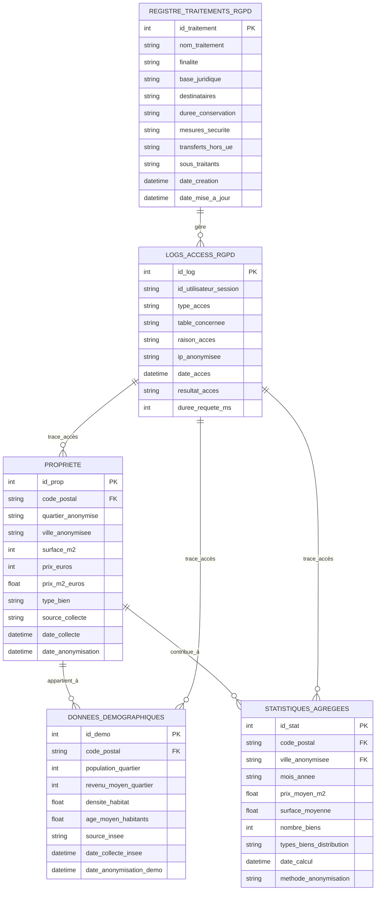

# MCD - Modèle Conceptuel des Données (RGPD)
# Observatoire Immobilier Public - Conformité RGPD

##  Objectifs RGPD

### 1. Minimisation des données
- Collecter uniquement les données nécessaires
- Anonymiser au niveau quartier (pas d'adresses précises)
- Limiter les champs personnelles au minimum

### 2. Finalité明确e
- Analyse des tendances immobilières
- Études démographiques et économiques
- Aucune finalité commerciale ou marketing

### 3. Durée de conservation
- Données anonymisées : 5 ans maximum
- Logs d'accès : 12 mois
- Registre des traitements : permanent

##  Entités Principales

### 1. PROPRIETE (Immobilier Anonymisé)
```
PROPRIETE
├── id_prop (PK)
├── code_postal (RGPD: 5 chiffres, niveau quartier)
├── quartier_anonymise (RGPD: nom générique)
├── ville_anonymisee (RGPD: >10000 habitants obligatoire)
├── surface_m2 (Donnée non personnelle)
├── prix_euros (Donnée non personnelle)
├── prix_m2_euros (Donnée calculée)
├── type_bien (Donnée non personnelle)
├── source_collecte (Donnée technique)
├── date_collecte (Donnée technique)
└── date_anonymisation (RGPD: tracking)
```

### 2. DONNEES_DEMOGRAPHIQUES (INSEE Anonymisé)
```
DONNEES_DEMOGRAPHIQUES
├── id_demo (PK)
├── code_postal (RGPD: clé étrangère vers PROPRIETE)
├── population_quartier (Donnée publique INSEE)
├── revenu_moyen_quartier (Donnée publique INSEE)
├── densite_habitat (Donnée publique INSEE)
├── age_moyen_habitants (Donnée publique INSEE)
├── source_insee (Donnée publique)
├── date_collecte_insee (Donnée technique)
└── date_anonymisation_demo (RGPD: tracking)
```

### 3. STATISTIQUES_AGREGEES (RGPD: Données anonymisées)
```
STATISTIQUES_AGREGEES
├── id_stat (PK)
├── code_postal (RGPD: clé étrangère)
├── ville_anonymisee (RGPD: clé étrangère)
├── mois_annee (RGPD: Période anonymisée)
├── prix_moyen_m2 (Donnée agrégée)
├── surface_moyenne (Donnée agrégée)
├── nombre_biens (Donnée agrégée)
├── types_biens_distribution (Donnée agrégée)
├── date_calcul (Donnée technique)
└── methode_anonymisation (RGPD: transparence)
```

### 4. REGISTRE_TRAITEMENTS_RGPD
```
REGISTRE_TRAITEMENTS_RGPD
├── id_traitement (PK)
├── nom_traitement (RGPD: obligatoire)
├── finalite (RGPD: obligatoire)
├── base_juridique (RGPD: obligatoire)
├── destinataires (RGPD: obligatoire)
├── duree_conservation (RGPD: obligatoire)
├── mesures_securite (RGPD: obligatoire)
├── transferts_hors_ue (RGPD: si applicable)
├── sous_traitants (RGPD: si applicable)
├── date_creation (RGPD: tracking)
└── date_mise_a_jour (RGPD: tracking)
```

### 5. LOGS_ACCESS_RGPD
```
LOGS_ACCESS_RGPD
├── id_log (PK)
├── id_utilisateur_session (RGPD: pseudonymisé)
├── type_acces (RGPD: lecture/écriture/suppression)
├── table_concernee (RGPD: tracking)
├── raison_acces (RGPD: finalité)
├── ip_anonymisee (RGPD: 4 premiers octets seulement)
├── date_acces (RGPD: tracking)
├── resultat_acces (RGPD: succès/échec)
└── duree_requete_ms (Donnée technique)
```

## 🔗 Relations (Cardinalités)

### 1. PROPRIETE ↔ DONNEES_DEMOGRAPHIQUES
```
PROPRIETE (1,1) ---< code_postal >--- (0,1) DONNEES_DEMOGRAPHIQUES
```
- Une propriété appartient à un quartier démographique
- Un quartier démographique peut avoir plusieurs propriétés

### 2. PROPRIETE ↔ STATISTIQUES_AGREGEES
```
PROPRIETE (N,N) ---< code_postal, ville_anonymisee >--- (1,1) STATISTIQUES_AGREGEES
```
- Plusieurs propriétés contribuent aux statistiques agrégées
- Une statistique agrégée couvre plusieurs propriétés

### 3. LOGS_ACCESS_RGPD ↔ [Toutes les tables]
```
LOGS_ACCESS_RGPD (N,N) ---< table_concernee >--- (1,N) [PROPRIETE, DONNEES_DEMOGRAPHIQUES, STATISTIQUES_AGREGEES]
```
- Tous les accès aux données sont tracés
- Chaque table peut faire l'objet de logs

##  Contraintes RGPD

### 1. Données personnelles interdites
```
 NOMS, PRÉNOMS, ADRESSES PRÉCISES
 TÉLÉPHONES, EMAILS, NUMÉROS SÉCURITÉ SOCIALE
 COORDONNÉS GPS PRÉCISES
 IDENTIFIANTS UNIQUES PERSONNELS
```

### 2. Données autorisées (anonymisées)
```
 CODE POSTAL (niveau quartier)
 VILLE (>10000 habitants obligatoire)
 QUARTIER (nom générique, pas de nom de rue)
 DONNÉES IMMOBILIÈRES (prix, surface)
 DONNÉES DÉMOGRAPHIQUES PUBLIQUES (INSEE)
 STATISTIQUES AGRÉGÉES
```

### 3. Contraintes temporelles
```
 ANONYMISATION : Immédiate à l'import
 CONSERVATION : 5 ans maximum
 LOGS ACCESS : 12 mois maximum
 ARCHIVAGE : Export vers format pérenne avant suppression
```

##  Traitements RGPD Déclarés

### 1. Traitement 1: Collecte données immobilières publiques
- **Finalité**: Analyse tendances marché immobilier
- **Base juridique**: Intérêt public (art. 6(1)(e) RGPD)
- **Durée**: 5 ans
- **Mesures**: Anonymisation immédiate, chiffrement base

### 2. Traitement 2: Agrégation statistiques
- **Finalité**: Études économiques et démographiques
- **Base juridique**: Recherche statistique anonymisée
- **Durée**: 5 ans
- **Mesures**: Agrégation automatique, suppression originaux

### 3. Traitement 3: Journalisation accès
- **Finalité**: Sécurité et traçabilité RGPD
- **Base juridique**: Obligation légale (art. 5(2) RGPD)
- **Durée**: 12 mois
- **Mesures**: Pseudonymisation, chiffrement logs

##  Diagramme MCD (Mermaid)



##  Validation RGPD MCD

###  Principes RGPD respectés:
1. **Légalité**: Finalités claires et bases juridiques définies
2. **Loyauté**: Transparence sur les traitements
3. **Limitation**: Collecte minimale et anonymisation
4. **Exactitude**: Données publiques uniquement
5. **Limitation durée**: 5 ans maximum
6. **Intégrité**: Mesures de sécurité techniques
7. **Responsabilité**: Registre complet et logs d'accès

###  Droits des personnes:
- **Droit d'information**: Registre accessible
- **Droit d'accès**: Via interface publique
- **Droit de rectification**: Non applicable (données anonymisées)
- **Droit à l'effacement**: Auto après 5 ans
- **Droit à la portabilité**: Export CSV possible
- **Droit d'opposition**: Non applicable (données publiques)